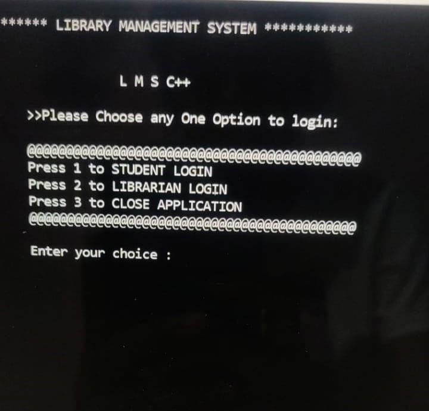
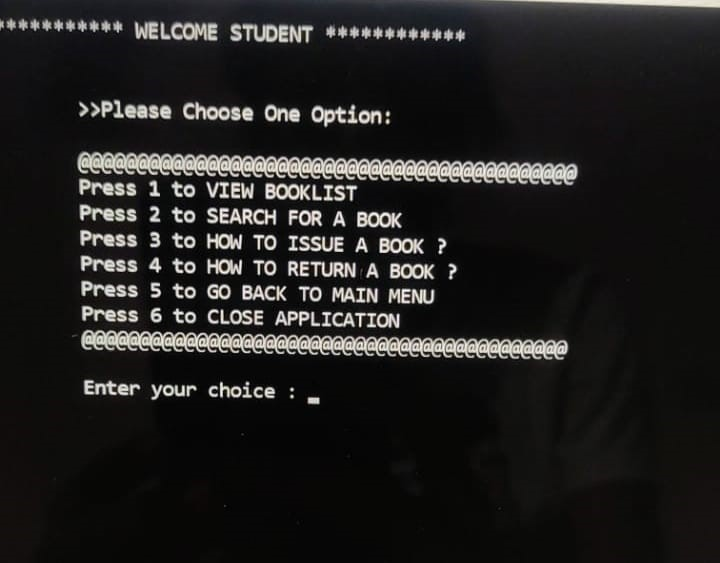
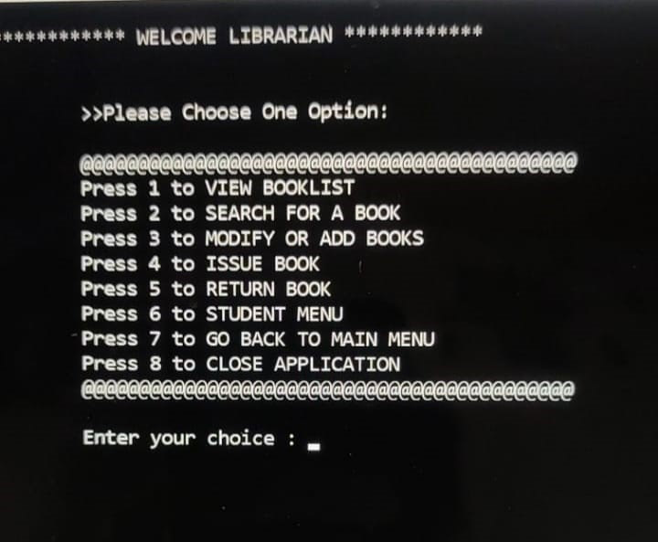
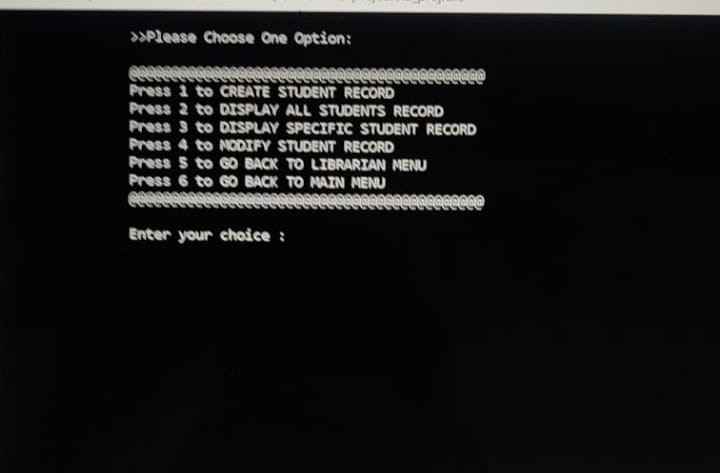

# Library Management System

The system allows librarians to add, update, and delete books from the library's catalog, as well as track the borrowing and returning of books.

**Technology Used:** C++, OOPS, File handling.

## Screenshots

- Main Menu

  

Inside the main menu there are 2 sub menus as follows:
1.	**Student login:** If a student wants to check the record of availability of book, he will log in to student menu. This is accessible to all students without any password.

2.	**Librarian login:** This login will be password protected only the librarian can access this menu. 

- Student Menu

  

- Librarian Menu

  

- Student Record Menu

  

# [Issues](https://github.com/PratikKontamwar/Library-Management-System/issues)

If you want to help don't hesitate to come up with ideas, bug reports, make pull requests, all you can do. Also if you have any questions, please use the same issues page